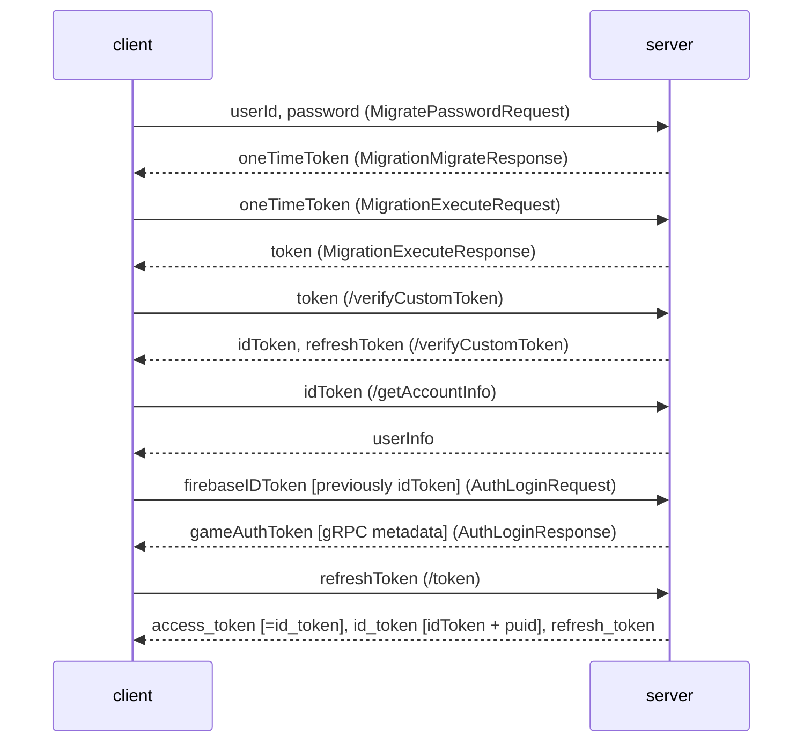

```mermaid
sequenceDiagram

client ->> server: userId, password (MigratePasswordRequest)

server -->> client: oneTimeToken (MigrationMigrateResponse)

client ->> server: oneTimeToken (MigrationExecuteRequest)

server -->> client: token (MigrationExecuteResponse)

client ->> server: token (/verifyCustomToken)

server -->> client: idToken, refreshToken (/verifyCustomToken)

client ->> server: idToken (/getAccountInfo)

server -->> client: userInfo

client ->> server: firebaseIDToken [previously idToken] (AuthLoginRequest)

server -->> client: gameAuthToken [gRPC metadata] (AuthLoginResponse)

client ->> server: refreshToken (/token)

server -->> client: access_token [=id_token], id_token [idToken + puid], refresh_token


```